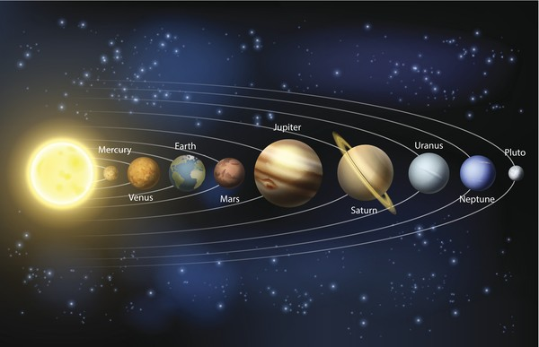

# Pertemuan-2
**teks**
*teks*
~~text~~ 

1. Merkurius
2. Venus
3. Bumi

- Saturnus
- Uranus
- Neptunus

[Tata Surya](https://solarsystem.nasa.gov/)

<!--  -->
| Planet | Diameter | Jumlah Satelit |
| ------- | -------- | -------------- |
| Bumi | 12.756 | 1 |
| Mars | 6.792 | 2 |
| Jupiter | 142.984 | 67 |